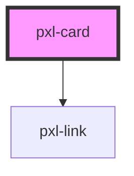

# pxl-content

<!-- Auto Generated Below -->

## Properties

| Property      | Attribute      | Description                    | Type     | Default |
| ------------- | -------------- | ------------------------------ | -------- | ------- |
| `content`     | `content`      | HTML which populates card main | `string` | `null`  |
| `disclosure`  | `disclosure`   |                                | `string` | `null`  |
| `headingText` | `heading-text` |                                | `string` | `null`  |

## Dependencies

### Depends on

- [pxl-link](../pxl-link)

### Graph

----------------------------------------------

A pixelrabbit project.
