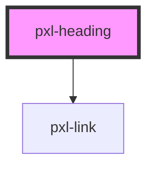

# pxl-heading

<!-- Auto Generated Below -->

## Properties

| Property | Attribute | Description                                           | Type                           | Default          |
| -------- | --------- | ----------------------------------------------------- | ------------------------------ | ---------------- |
| `href`   | `href`    | makes heading container for link                      | `string`                       | `null`           |
| `label`  | `label`   | label over heading, sometimes used for taxonomy label | `string`                       | `null`           |
| `level`  | `level`   | heading level                                         | `"h1" \| "h2" \| "h3" \| "h4"` | `"h2"`           |
| `text`   | `text`    | heading text                                          | `string`                       | `"Heading text"` |

## Dependencies

### Depends on

- [pxl-link](../pxl-link)

### Graph

----------------------------------------------

A pixelrabbit project.
