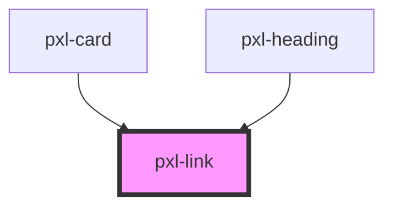

# pxl-link

<!-- Auto Generated Below -->

## Properties

| Property   | Attribute  | Description                                       | Type      | Default |
| ---------- | ---------- | ------------------------------------------------- | --------- | ------- |
| `external` | `external` | (optional) Determines if link opens in new window | `boolean` | `false` |
| `href`     | `href`     |                                                   | `string`  | `"#"`   |
| `icon`     | `icon`     | (optional) Icon which appears in link             | `string`  | `null`  |
| `text`     | `text`     |                                                   | `string`  | `null`  |

## Dependencies

### Used by

 - [pxl-card](../pxl-card)
 - [pxl-heading](../pxl-heading)

### Graph

----------------------------------------------

A pixelrabbit project.
